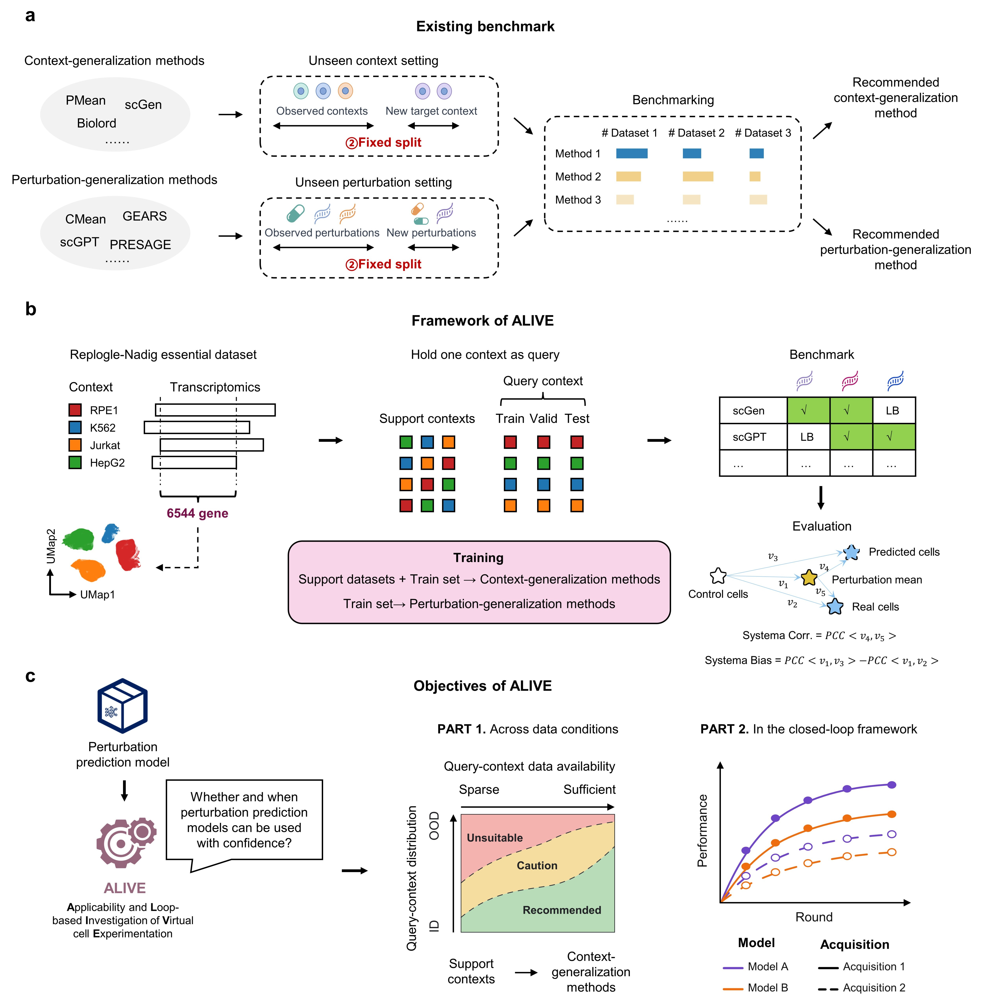

# ALIVE: Applicability and Loop-based Investigation of Virtual cell Experimentation

ALIVE, a framework designed to investigate whether and under what conditions perturbation prediction models provide practical utility.
The repository contains the release version used to generate the evaluation tables and figures accompanying our study.



## What ALIVE evaluates

ALIVE is designed for understanding rather than ranking, exposing three tasks with stable public names:

- `InDistribution`: random data-scaling experiments within a context.
- `OutOfDistribution`: fixed cluster/context holdouts.
- `ActiveLearning`: iterative acquisition from an unlabeled perturbation pool.

All runtime summaries use the same five metrics:

`MSE`, `MAE`, `Correlation`, `Systema Correlation`, and `Systema Bias`.

## Baseline families

ALIVE enables evaluation of diverse perturbation prediction algorithms:

### Context-generalization methods

`Biolord`, `PMean`, and `scGen` use support context. They support zero-shot
initialization as an available option.

### Perturbation-generalization methods

`CMean`, `GEARS`, `GenePert`, `LM`, `PRESAGE`, `scGPT`, and `scLambda` do not
use support context and do not support zero-shot startup.

## Repository layout

```text
.
├── alive/                         # Core tasks, metrics, validation, and tools
├── baseline/
│   ├── context_generalization/    # Biolord, PMean, scGen
│   └── perturbation_generalization/ # CMean, GEARS, GenePert, LM, PRESAGE, scGPT, scLambda
├── data/                          # Processed dataset (Zenodo; coming soon)
│   └── essential_atlas/
├── resources/                     # Large model/data resources (Zenodo; coming soon)
├── results/                       # Released InDistribution/OutOfDistribution/ActiveLearning summaries
├── figure/                        # Reproducible figure notebooks and exports
└── reproducibility/               # Example reruns and execution logs
```

The `data/` and `resources/` directories contain large dataset and model
resource files hosted separately on Zenodo. **Coming soon:** We will provide
the `data_resources` download link and the complete baseline files as part of
the release package.

## Installation

Create a common Python environment for ALIVE and install the dependencies used
by the core benchmark:

```bash
conda create -n alive python=3.11 -y
conda activate alive
pip install numpy pandas scipy scikit-learn anndata scanpy dcor matplotlib jupyter
```

Some baselines require additional packages or a dedicated environment. Their
environment specifications are kept next to the method, for example
`baseline/perturbation_generalization/PRESAGE/environment.yml`,
`baseline/perturbation_generalization/scGPT/environment.yml`, and
`baseline/perturbation_generalization/scLambda/environment.yml`. For best compatibility,
we recommend creating each method’s environment according to the installation instructions in its original repository.

## Running a benchmark

Each baseline provides task-specific entry scripts. For example:

```bash
python baseline/perturbation_generalization/PRESAGE/in_distribution.py
python baseline/perturbation_generalization/PRESAGE/out_of_distribution.py
python baseline/perturbation_generalization/PRESAGE/active_learning.py
```

The same layout is available for the other baselines. A run writes its resolved
configuration, per-round predictions, and `achievement_summary.csv` under
`results/<task>/<dataset>_<cell_type>/<method>/`.

The default HepG2 example uses the essential atlas. To run another dataset or
cell type, edit the script-owned `alive_config` (or pass a copied config to
the entry point) while keeping the shared ALIVE configuration contract.

## Rebuilding summaries

Summaries can be rebuilt from saved `pred_bulk` files after metric definitions
or column names change:

```bash
python -m alive.tools.rebuild_runtime_summary \
  --root-dir results/in_distribution
```

Use `--run-dir` for one run, or `--methods` to restrict a batch. The existing
summary is overwritten only at the selected output path; keep a copy if an
older summary is needed for comparison.

## Reproducibility and figures

The `reproducibility/` directory contains representative HepG2 rerun scripts
and logs for PRESAGE and scLambda. Figure notebooks under `figure/` read the
released local summaries and can be executed to plot main figures.

## Contact

nsk25@mails.tsinghua.edu.cn
